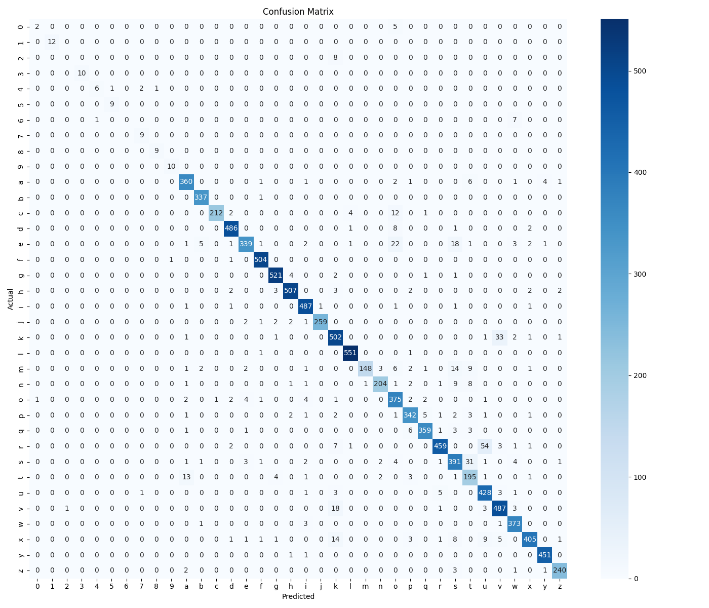

# ASL Model Evaluation Report

Generated on: 2025-05-31 10:17:57

## Confusion Matrix

## Classification Report

|              |   precision |   recall |   f1-score |      support |
|:-------------|------------:|---------:|-----------:|-------------:|
| 0            |    0.666667 | 0.285714 |   0.4      |     7        |
| 1            |    1        | 1        |   1        |    12        |
| 2            |    0        | 0        |   0        |     8        |
| 3            |    1        | 1        |   1        |    10        |
| 4            |    0.857143 | 0.6      |   0.705882 |    10        |
| 5            |    0.9      | 1        |   0.947368 |     9        |
| 6            |    0        | 0        |   0        |     8        |
| 7            |    0.75     | 1        |   0.857143 |     9        |
| 8            |    0.9      | 1        |   0.947368 |     9        |
| 9            |    0.909091 | 1        |   0.952381 |    10        |
| a            |    0.935065 | 0.954907 |   0.944882 |   377        |
| b            |    0.973988 | 0.997041 |   0.98538  |   338        |
| c            |    0.995305 | 0.917749 |   0.954955 |   231        |
| d            |    0.975904 | 0.975904 |   0.975904 |   498        |
| e            |    0.963068 | 0.853904 |   0.905207 |   397        |
| f            |    0.984375 | 0.996047 |   0.990177 |   506        |
| g            |    0.979323 | 0.984877 |   0.982092 |   529        |
| h            |    0.980658 | 0.973129 |   0.976879 |   521        |
| i            |    0.962451 | 0.98783  |   0.974975 |   493        |
| j            |    0.996154 | 0.970037 |   0.982922 |   267        |
| k            |    0.896429 | 0.926199 |   0.911071 |   542        |
| l            |    0.987455 | 0.996383 |   0.991899 |   553        |
| m            |    0.993289 | 0.778947 |   0.873156 |   190        |
| n            |    0.966825 | 0.89083  |   0.927273 |   229        |
| o            |    0.858124 | 0.94697  |   0.90036  |   396        |
| p            |    0.93956  | 0.944751 |   0.942149 |   362        |
| q            |    0.9729   | 0.959893 |   0.966353 |   374        |
| r            |    0.976596 | 0.869318 |   0.91984  |   528        |
| s            |    0.865044 | 0.882619 |   0.873743 |   443        |
| t            |    0.761719 | 0.882353 |   0.81761  |   221        |
| u            |    0.857715 | 0.968326 |   0.909671 |   442        |
| v            |    0.915414 | 0.949318 |   0.932057 |   513        |
| w            |    0.941919 | 0.986772 |   0.963824 |   378        |
| x            |    0.971223 | 0.9      |   0.934256 |   450        |
| y            |    0.986871 | 0.995585 |   0.991209 |   453        |
| z            |    0.97561  | 0.97166  |   0.973631 |   247        |
| accuracy     |    0.945033 | 0.945033 |   0.945033 |     0.945033 |
| macro avg    |    0.877663 | 0.870752 |   0.869767 | 10570        |
| weighted avg |    0.945856 | 0.945033 |   0.944322 | 10570        |